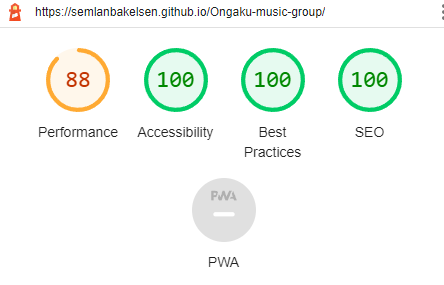

# Ongaku Music Group
Ongaku Music Group is a website created by the passionate and music-loving people who make up Ongaku Music Group. The webpages purpose is to spark an interest in other music lovers that would like to play together with people that truly live to play. Ongaku Music group is a simple jet effective webpage that focuses on getting straight to the point. For the people who burn for music then Ongaku Music Group is a truly great fit.

## Features
* **The header**
     * Featured at the top of the page in big letters so it's easy for the user to read and understand the name.
     * Wrapped in a light blue banner brings attention to the top of the page where the header is located.
* **Navigation**
     * Located at the top right of the page wrapped in the blue banner with spacious borders giving the navigation buttons a bigger look, making the user more likely to look at them.
     * Giving the user the option to jump right ahead to any section of the webpage so the user feels more comfortable and understands the layout right away.
   
 
* **Hero Image**
     * Giving the user a big image that tells the user that this is a music webpage, an image of a few people playing different instruments to get the user in a peaceful piece of mind.
* **The About Section**
     * A short summary of the people behind the group and information about how much they like music.
     * A dedicated schedule for when the group would meet, giving the user valuable information till they would join.

 
* **The Sign Up Form**
     * The sing up form gives the user the immediate possibility to join the group if they so wish.

 
* **The Contact Section**
     * In the contact section the user has access to all contact information of the webpage right in one place.
     * The user can open the social media links in a new tab or use the phone, email, and address that's written in the section.

 

  ## Testing
* The website has been thoroughly tested throughout the making of the page. Viewed the page in multiple different sizes and configurations during the making the page.
* Tested the navigation links so that they bring the user to the correct place.
* Made sure that the form submission works so the user gets a valid response through Code Institutes [form dump](https://formdump.codeinstitute.net/). 

## Bugs
* When making responsive design the header and the navigation links would stack vertically. Was able to fix the problem by putting `Display: inline;` style on the navigation list items.
* Struggled for a while to get responcive design to work for smaller screen sizes until I removed my code tries and put `text-align: center;` on only 2 ids and it worked without me needing to change what size it should be.
## Validation
* HTML
     * Gave a warning regarding lack of header at the "Hero Image" location, where I don't use a header anyway. No further problems
* CSS
     * Passed the chack without any warnings or errors.
* Accessibility
    * I chose colors for the page that would be easy to differentiate between. And got good scores on the lighthouse test.

    

## Deployment
* The page was deployed through GitHub.
     * By navigating to the settings of the repository then click on 'Pages' in the menu.
     * Then choose the branch main and click on save.
     * The link will be available just a minute later.  

Here is the link to the page: https://semlanbakelsen.github.io/Ongaku-music-group/

## Credits
### Media
     * The two images on the webpage were taken from https://pexels.com/.
     * The footer icons are from https://fontawesome.com/.
     * The header font used on h1 and h2 are from https://fonts.google.com/.

* instrumets.jpg: https://unsplash.com/photos/cW3nDFVpi10
* stage.jpg: https://unsplash.com/photos/z9z6u1rn7sY
* red-note.jpg: https://unsplash.com/photos/qt7S2QuAhJI
* note-and-violin.jpg: https://unsplash.com/photos/GbSCAAsU2Fo
* guitars.jpg: https://unsplash.com/photos/U2azMu57UEY

    
### Content
     * The footer icons code is from the love Running project.
     * The style rules added to the form are inspired by the Love Running projects form styles.