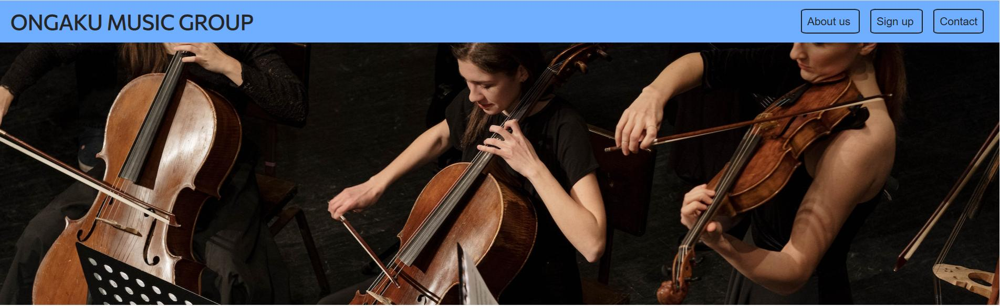

# Ongaku Music Group
Ongaku Music Group is a website created by the passonate and music loving people who make up Ongaku Music Group. The webpages purpos is to spark an intrest in other music lovers that would like to play togheter with people that truly live to play. Ongaku Music group is a simple jet effective webpage that focuses on getting straight to the point. For the people who really burn for music then Ongaku Music Group is a truly great fit.

## Features
* **The header**
     * Featured at the top of the page in big letters so it's easy for the user to read and understande the name.
     * Wrapped in a light blue banner brings attention to the top op the page where the header is located.
* **Navigation**
     * Located at the top right of the page wrapped in the blue banner with spacius borders giving the navigation buttons a bigger look, making the user more likely to look at them.
     * Giving the user the option to jump right ahead to any section of the webpage so the user feel more comfortable and understand the layout right away.
      
 
* **Hero Image**
     * Giving the user a big image that tells the user that this is a music webpage, an image of a few people playing different instuments to get the user in a peaceful piece of mind.
* **The About Section**
     * A short summery of the people behind the group and information about how much they like music.
     * A dedicated schedule for when the group would to meet, giving the user valuable information till they would join.

 
* **The Sign Up Form**
     * The sing up form gives the user the immediate possibility to join the group if they so wish.

 
* **The Contact Section**
     * In the contact section the user have acces to all contact information of the webpage right at one place.
     * The user can open the social media links in a new tab or use the phone, email and address that's written in the section.

 

  ## Testing
* The website have been thoroughly tested thru out the making of the page. Viewed the page in multiple different sizes and configurations during the making of the page.
* Tested the navigation links so that they bring the user to the correct place.
* Made sure that the form submition works so the user gets a valid responce through Code Institutes [form dump](https://formdump.codeinstitute.net/). 

## Bugs
* When making responcive design the header and the navigation links would stack vartically. Was able to fix the problem by putting `Display: inline;` style on the navigation list items.
* Struggeled for a while to get responcive design to work for smaller screen sizes untill I removed my code tries and put `text-align: center;` on only 2 id's and it worked without me needint to change what size it should be.
## Validation
* HTML
     * Gave a warning regarding lack of header at the "Hero Image" location, where I don't use a header anyway. No further problems
* CSS
     * Passed the chack without any warnings or errors.
* Accessibility
    * I chose colors for tha page that would be easy to differentiate between. And got good scores on the lighthouse test.

    

## Deplaoment
* The page was deployed through GitHub.
     * By navigating to the settings of the repository then click on 'Pages' in the menu.
     * Then choose the branch main and click on save.
     * The link will be avalibly just a minute later.  